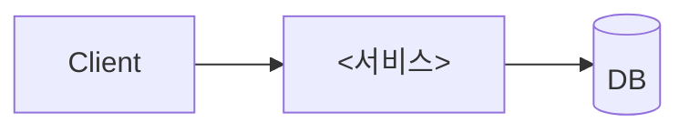

# <레포 이름> 온보딩

> 기준 커밋: `<sha>` · 작성일: <YYYY-MM-DD> · 모드: <quick|standard|deep> · 스택: <예: Java 17 / Spring Boot 3.2 / JPA / Kafka>
> 근거 표기: `path:line` · 확인하지 못한 내용은 **(추정)**

## 한눈에 보기
- **무엇을 하나**: <1줄>
- **누가 쓰나 / 누구와 통신하나**: <1줄>
- **핵심 기술**: <1줄>

## 기술 스택
| 영역 | 기술 | 근거 |
|---|---|---|
| 언어/런타임 | | |
| 프레임워크 | | |
| 데이터 | | |
| 메시징/캐시 | | |
| 빌드/배포 | | |

## 아키텍처
<스타일(레이어드/헥사고날/Clean/CQRS)과 판단 근거>



### 모듈 지도
| 모듈/프로젝트 | 역할 | 의존 대상 |
|---|---|---|

## 진입점
| 종류 | 위치 | 개수/대상 | 비고 |
|---|---|---|---|
| HTTP | | | |
| 메시지 | | | |
| 스케줄/배치 | | | |

공통 전처리(필터/미들웨어/AOP): <목록과 순서>

## 핵심 흐름
| 흐름 | 요약 | 문서 |
|---|---|---|
| | | [flows/<slug>.md](flows/<slug>.md) |

## 데이터
- 저장소: <DB 종류, 개수, 용도>
- 접근 방식: <JPA/MyBatis/EF Core/Dapper…>
- 마이그레이션: <도구, 위치>
- 트랜잭션 경계: <어디서 시작/커밋되나>

```mermaid
erDiagram
```

## 연동
| 대상 | 방식 | 위치 | 타임아웃/재시도 |
|---|---|---|---|

## 보안
- 인증: 
- 인가: 
- 시크릿 주입 방식: <키 이름만>

## 로컬 실행
1. 사전 준비: <JDK/SDK 버전, docker-compose 등>
2. 필요한 설정 키: <환경변수/설정 키 이름>
3. 실행: `<명령>`
4. 확인: `<헬스체크 URL 등>`

## 테스트
- 종류와 위치: 
- 실행: `<명령>`

## 설정 · 배포 · 관측성
- 프로파일/환경: 
- CI/CD: 
- 배포 대상: 
- 로그/메트릭/트레이싱: 

## 리스크와 핫스팟
| 위치 | 이유 | 근거 |
|---|---|---|

## 먼저 읽을 파일 5개
1. `<path>` — <이유>

## 다음 단계
- 열린 질문: [QUESTIONS.md](QUESTIONS.md)
- 용어: [GLOSSARY.md](GLOSSARY.md)
