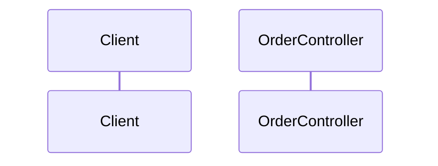

# <흐름 이름> (`POST /api/orders`)

> 기준 커밋: <sha> · 작성일: <YYYY-MM-DD>

## 요약
<3줄 이내: 무엇을 하고, 무엇을 바꾸고, 무엇을 발행하는가>

## 시퀀스

## 단계별 상세
| # | 위치 | 하는 일 | 비고 |
|---|---|---|---|
| 1 | `OrderController.java:42` | 요청 검증 후 서비스 호출 | `@Valid` |

## 데이터 변경
| 테이블/엔티티 | 연산 | 트랜잭션 |
|---|---|---|

## 부수효과
- 이벤트/외부 호출/캐시

## 실패 경로
- 예외 → 응답 매핑

## 관찰 & 리스크
- (근거와 함께)
